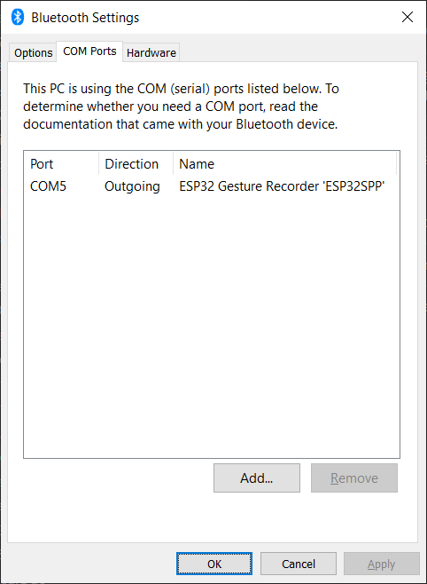

# SERIAL MODE

# BLUETOOTH MODE
Starting the device in this mode will create a new bluetooth device named by default ESP32 Gesture Recorder.
You can change it if you really like.
On windows, the easiest way to add this is as follows:
1. go to bluetooth settings.
2. On the right side it says "More Bluetooth Options".
3. A new dialog box will open and it will say "Com Ports" in one of the tabs at the top.
4. Go to that tab (see image below):

5. Click Add
6. A new dialog will pop up, giving you different options (it may take a moment to come up)
7. Select outgoing since your PC will be initializing the connection
8. Select the bluetooth device in the dropdown for "Device that will use the com port". 
It will be ESP32 Gesture Recorder unless you changed it
9. Hit okay
10. Take note of the name of the COM port that was created.

# WIFI MODE
Start the processing server with WIFI turned on.
It will spit out a "Started the server at 192.168.x.x"
Put that address in the arduino sketch and upload it to your ESP32.
Make sure to open up the port you've selected in your firewall for the computer running processing.
I had trouble with this even when I added explicit rules.